# OpenDevOps
###### This is ONLY for DevOps learning and practice. Please contact the software vendor to get the product license if you are a company.

## Framework

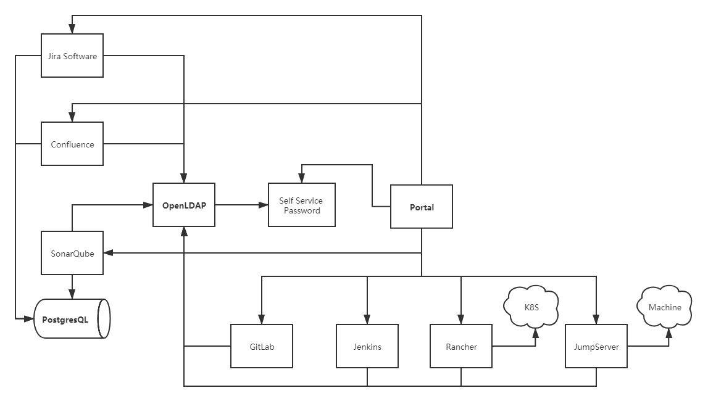

## Quick Start

#### Resource

Type | CPU | Memory 
----|----|----
Minimum | 4 core | 8 G
Recommend | 8 core | 16 G
Optimum | 16 core | 32 G

#### Deployment

1. Clone project <br>`git clone https://github.com/QualitySphere/OpenDevOps.git`
2. Change dir to ODO home <br>`cd OpenDevOps`
3. Start ODO services <br>`./odoctl start all`

#### Configuration

- **OpenLDAP**
  - Access phpLDAPadmin `http://ODO-HOST:18880` and click `login` 
  - Input `cn=admin,dc=qualitysphere,dc=github,dc=io` as Login DN and `opendevops` as Password, and then click `Authenticate` <br>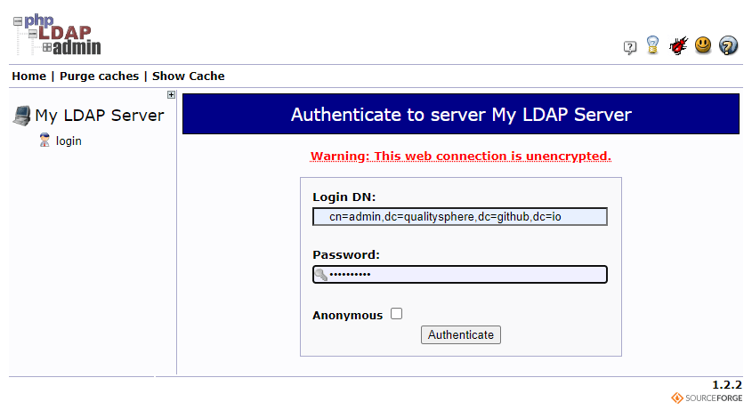
  - Click `import` button and copy content from `odo-ldap/ssp/odo_users.ldif` into the text area <br>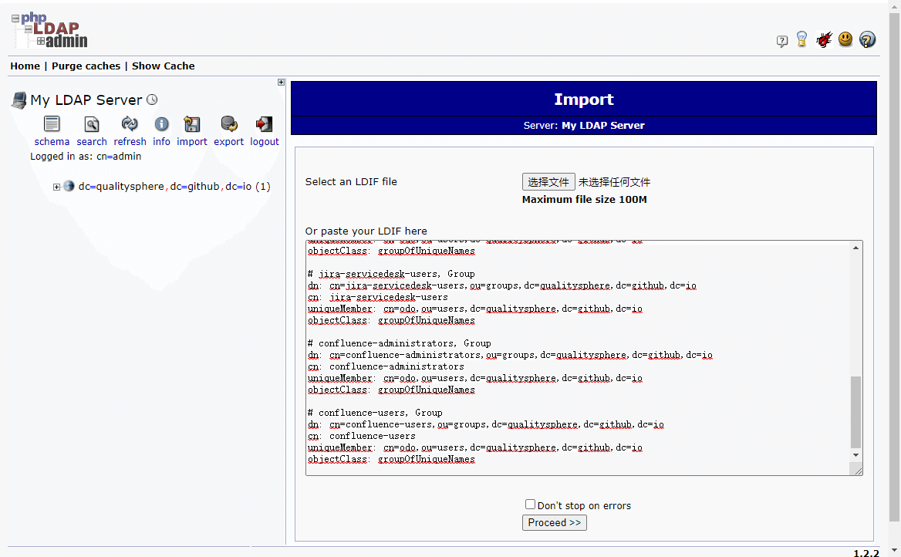
  - Click `Proceed` to complete OpenLDAP configuration <br>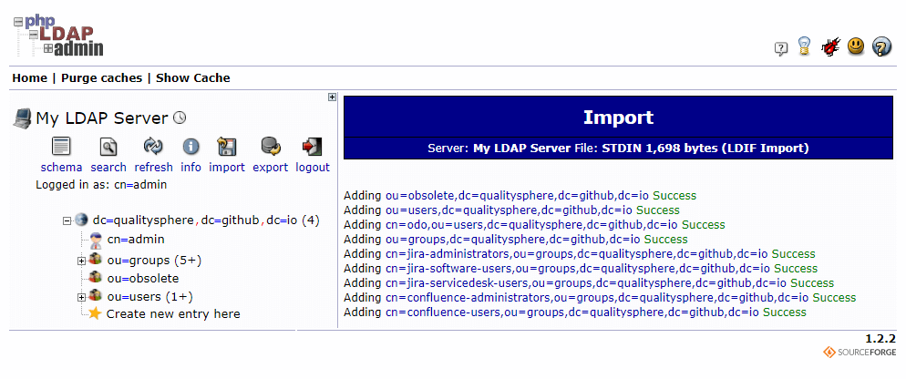
- **Self** **Service** **Password**
  - Access Self Service Password `http://ODO-HOST:18080`
  - Try to update default account `odo`'s password to validate SSP
  - Try to update `odo`'s password via E-mail. <br>if you find there is no hostname in the reset password link, you can update `$reset_url` in `odo-ldap/ssp/config.inc.php`
- **Jira** **Software**
  - Access Jira Software `http://ODO-HOST:8080` and select `I'll set it up myself` <br>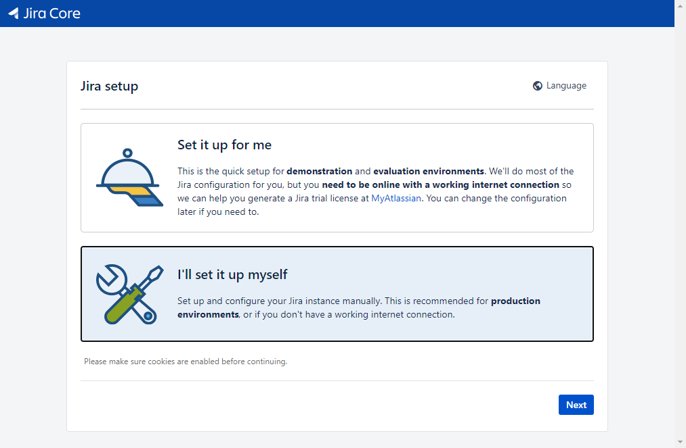
  - Input database information<br>hostname can use container name `odo-pg`, DB name is `jira` and Pg default acount/password is `postgres/opendevops` <br> click `Test Connection` to check it <br>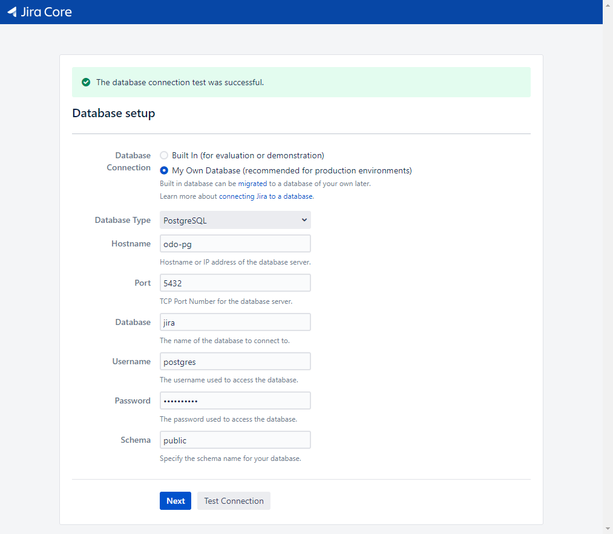
  - Wait while the database is set up. This may take a minute. <br>Click `Next` to set up application properties. <br>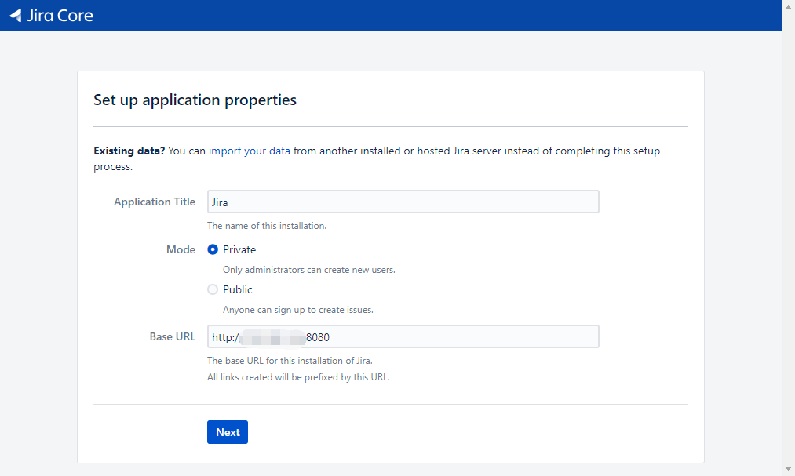
  - If there is a specify license key page. Go back to ODO-HOST server run `./odoctl license jira` <br>Copy generated license key and input the text area <br>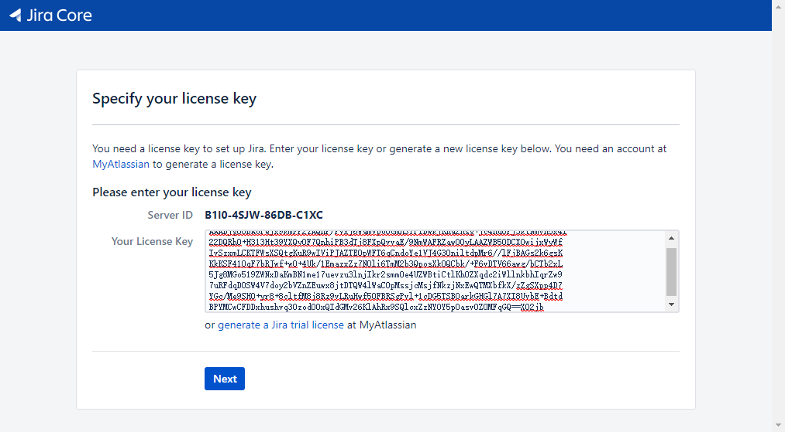
  - Click `Next` to complete Jira Software installation
  - Create administrator account <br>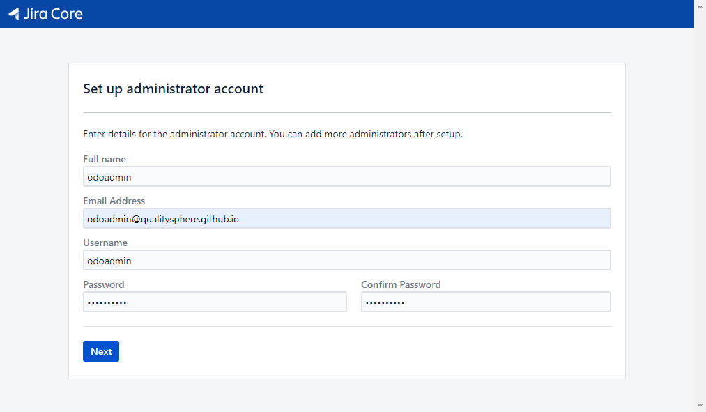
  - Click `Next` and then `Finish` Jira Software configuration
- **Confluence**
  - Access Confluence Server `http://ODO-HOST:8090` and click `Next`
  - Get `Server ID` from license key page and then go back to ODO-HOST to run `./odoctl license conf <serverId>` to generate license key
  - Copy the license key and active Confluence Server <br>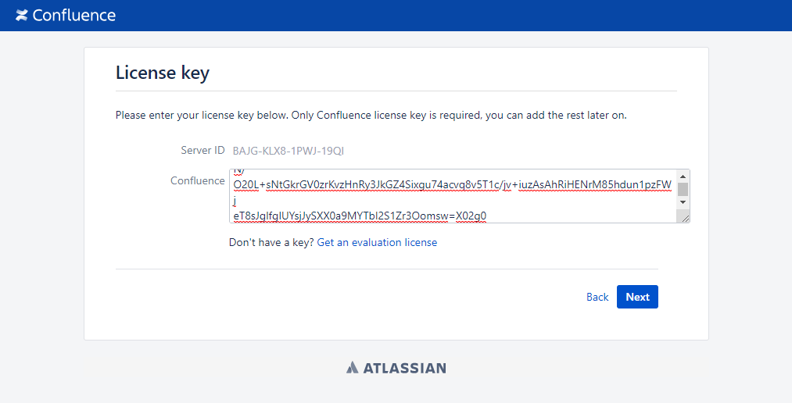
  - Select `My own database` and click `Next` <br>
  - Set up database <br>hostname can use container name `odo-pg`, DB name is `conf` and Pg default account/password is `postgres/opendevops` <br>Click `Test connection` to check data correction <br>
  - Click `Empty Site` to start configure user management <br>
  - Select `Manage users and groups within Confluence` and create administrator for Confluence <br>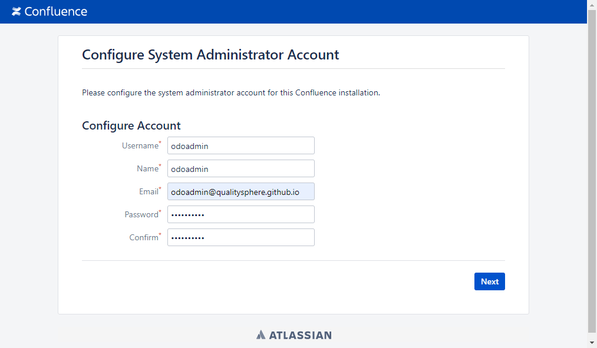
  - Click `Next` to complete Confluence configuration
- **GitLab**
  - Install 
  - Update config
  - Restart GitLab
- **Jenkins**
- **SonarQube**
  - Access and install LDAP plugin
  - Edit properties file to enable LDAP
  - Restart SonarQube
- **Harbor**
- **Rancher**
- **JumpServer**

#### Manual

- [Jira Software](https://docs.atlassian.com/jira/jsw-docs-0811/)
- [Confluence](https://docs.atlassian.com/confluence/docs-75/)
- [GitLab](https://docs.gitlab.com/ee/README.html)
- [Jenkins](https://www.jenkins.io/zh/doc/book/blueocean/creating-pipelines/)
- [SonarQube](https://docs.sonarqube.org/latest/)
- [Harbor](https://goharbor.io/docs/2.0.0/working-with-projects/)
- [Rancher](https://rancher.com/docs/rancher/v2.x/en/)
- [JumpServer](https://docs.jumpserver.org/zh/master/admin-guide/quick_start/)

## Tool Chain

Service|Port|Container Port|Volume|Container Volume
----|----|----|----|----
OpenLDAP|18389|389|odo-ldap/db<br>odo-ldap/config|/var/lig/ldap<br>/etc/ldap
PHPLdapAdmin|18880|80|-|-
Self Service Password|18080|80|odo-ldap/ssp/config.inc.php|/var/www/html/conf/config.inc.php
PostgresQL|18432|5432|odo-pg|/var/lib/postgresql/data
Jira|8080|8080|odo-jira|/var/atlassian/application-data/jira
Confluence|8090<br>8091|8090<br>8091|odo-conf|/var/atlassian/application-data/confluence
GitLab|12080<br>12443<br>222|80<br>443<br>222|odo-gitlab/data<br>odo-gitlab/config|/var/opt/gitlab<br>/etc/gitlab
Jenkins|15080<br>50000|8080<br>50000|odo-jenkins/jenkins_home<br>/var/run/docker.sock|/var/jenkins_home<br>/var/run/docker.sock
SonarQube|9000|9000|odo-sonar/data<br>odo-sonar/logs<br>odo-sonar/extensions<br>odo-sonar/sonar.properties|/opt/sonarqube/data<br>/opt/sonarqube/logs<br>/opt/sonarqube/extensions<br>/opt/sonarqube/conf/sonar.properties
Harbor||||
Rancher|17443|443|odo-rancher|/var/lib/rancher
JumpServer|17080<br>2222|80<br>2222|odo-jms/data<br>odo-jms/mysql|/opt/jumpserver/data<br>/var/lib/mysql
Portal|80<br>443|80<br>443||

## odoctl 

- commands
```bash
./odoctl <COMMAND>:
    start     - Up container(s) to start service(s)
    stop      - Stop container(s) to stop service(s)
    down      - Down all services
    restart   - Restart container(s) to restart service(s)
    list      - List container(s)
    license   - Generate JIRA/Confluence/Plugin license
    cleanup   - Cleanup all containers and dirs
```

- services
```bash
./odoctl start/stop/restart <SERVICE>:
    all       - All Services
    ldap      - OpenLDAP, PhpLDAPAdmin and Self Service Password
    pg        - PostgresQL
    jira      - Jira Software
    conf      - Confluence
    sonar     - SonarQube Community Edition
    jenkins   - Jenkins
    gitlab    - GitLab Community Edition
    rancher   - Rancher
    jms       - JumpServer
```

- list containers
```bash
./odoctl list
```

- generate license for JIRA/Confluence
```bash
./odoctl license <PRODUCT>:
    jira          - Generate JIRA software license
    jira_plugin   - Generate JIRA plugin license
    conf          - Generate Confluence server license
    conf_plugin   - Generate Confluence plugin license

./odoctl license jira_plugin/conf/conf_plugin <PRODUCT_ID>:
    PRODUCT_ID is REQUIRED
      +-------------+------------+------------------------------------+
      | PRODUCT     | PRODUCT_ID | WHERE                              |
      +-------------+------------+------------------------------------+
      | jira_plugin | plugin ID  | JIRA application detail page       |
      +-------------+------------+------------------------------------+
      | conf        | server ID  | Confluence installation page       |
      +-------------+------------+------------------------------------+
      | conf_plugin | plugin ID  | Confluence application detail page |
      +-------------+------------+------------------------------------+
```

- cleanup ODO services and dirs 

```bash
./odoctl cleanup
```

## ODO Dockerfiles

- [Self Service Password](https://github.com/seoktaehyeon/docker-self-service-password/blob/1.3/Dockerfile)
- [Jira Software](https://github.com/seoktaehyeon/docker-jira-software/blob/8.11/Dockerfile)
- [Confluence Server](https://github.com/seoktaehyeon/docker-confluence-server/blob/7.5/Dockerfile)

